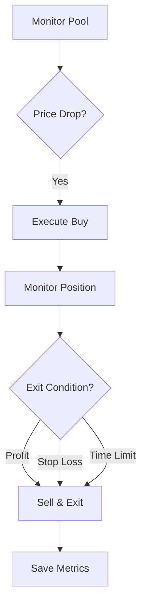

# 🚀 Raydium AMM Trading Bot

> **High-frequency automated trading bot for Raydium AMM V4 pools on Solana**

[](https://www.rust-lang.org/)
[](https://solana.com/)
[](LICENSE)

## ✨ Features

- 🔄 **Real-time monitoring** of Raydium AMM V4 pools
- ⚡ **High-speed execution** with 400ms price updates
- 🛡️ **MEV protection** via Nozomi, Jito, or Zero Slot
- 📊 **Automated trading** with configurable entry/exit strategies
- 📈 **Performance tracking** with MongoDB integration
- 🌐 **REST API** for monitoring and control

## 🚀 Quick Start

### 1. Setup Environment

Create a `.env` file:

```env
# 🔑 Wallet
PRIVATE_KEY=your_base58_private_key

# 🏊 Pool to Monitor
POOL_ADDRESS=your_raydium_pool_address

# 💰 Trading Settings
BUY_SOL_AMOUNT=0.1
ENTRY_PERCENT=5.0
SLIPPAGE=1.0

# 🌐 Network
RPC_ENDPOINT=https://your-rpc-endpoint.com
GEYSER_URL=your_yellowstone_grpc_endpoint
X_TOKEN=your_grpc_token

# ⚡ MEV Service
CONFIRM_SERVICE=NOZOMI
```

### 2. Run the Bot

```bash
# Build and run
cargo build --release
cargo run --release
```

## 🎯 How It Works



### Trading Strategy

1. **📊 Monitor** - Tracks pool price changes in real-time
2. **📉 Entry** - Buys when price drops by `ENTRY_PERCENT`
3. **📈 Exit** - Sells when:
   - Profit target reached (`TAKE_PROFIT`)
   - Stop loss triggered (`STOP_LOSS`)
   - Time limit exceeded (`AUTO_EXIT`)

## ⚙️ Configuration

| Setting | Description | Example |
|---------|-------------|---------|
| `BUY_SOL_AMOUNT` | SOL amount to trade | `0.1` |
| `ENTRY_PERCENT` | Price drop trigger | `5.0` |
| `TAKE_PROFIT` | Profit target % | `10.0` |
| `STOP_LOSS` | Loss limit % | `5.0` |
| `AUTO_EXIT` | Max hold time (seconds) | `300` |

## 🛡️ MEV Services

| Service | Features |
|---------|----------|
| **Nozomi** | Fast execution, priority fees |
| **Jito** | MEV protection, bundles |
| **Zero Slot** | Alternative service |

## 📊 API Endpoints

The bot includes a REST API for monitoring:

```bash
# Health check
curl http://localhost:3000/health

# Current status
curl http://localhost:3000/status

# Pool price
curl http://localhost:3000/pool-price

# Wallet info
curl http://localhost:3000/wallet
```

## 🏗️ Architecture

```
src/
├── main.rs              # 🚀 Entry point
├── config/              # ⚙️ Configuration
├── instructions/        # 🔄 Trading logic
├── service/             # 🛡️ MEV services
├── utils/               # 🛠️ Utilities
└── error/               # ❌ Error handling
```

